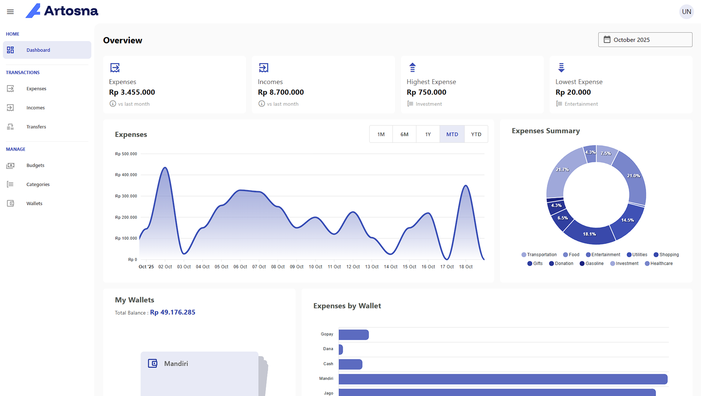

# 🌿 Artosna — Personal Financial Tracker


---

**Artosna** helps you stay financially mindful by tracking your income, expenses, and budgets in a calm and minimalist way.  
Built with **Vue 3**, **Vuetify**, and **Supabase**, it offers a smooth and elegant experience for managing your personal finances.

---

## 🖼️ Preview

  
<sub>*Example preview — replace with your own screenshot or app banner.*</sub>

---

## ✨ Features

- 📊 Track income & expenses  
- 💰 Manage budgets & spending goals  
- 🗂️ Categorize transactions  
- 📅 Periodic summaries (daily, weekly, monthly)  
- ☁️ Cloud sync via Supabase  
- 🔐 Secure authentication (Supabase Auth)  
- 📱 PWA support — installable & works offline  
- 🎨 Beautiful Material Design UI with Vuetify  

---

## 🧩 Tech Stack

| Technology | Purpose |
|-------------|----------|
| [Vue 3](https://vuejs.org/) | Frontend framework |
| [Vite](https://vitejs.dev/) | Development & build tool |
| [Vuetify](https://vuetifyjs.com/) | Material Design UI components |
| [Pinia](https://pinia.vuejs.org/) | State management |
| [Vue Router](https://router.vuejs.org/) | Client-side routing |
| [Supabase](https://supabase.com/) | Authentication & database |
| [Tailwind CSS](https://tailwindcss.com/) | Optional utility-first styling |
| [PWA](https://developer.mozilla.org/en-US/docs/Web/Progressive_web_apps) | Offline & installable support |

---

## 🚀 Quick Start

```bash
# Clone the project
git clone https://github.com/yourusername/artosna.git
cd artosna

# Install dependencies
npm install

# Set up environment variables
cp .env.example .env
# Add your Supabase keys:
# VITE_SUPABASE_URL=your-url
# VITE_SUPABASE_ANON_KEY=your-anon-key

# Run in development
npm run dev
